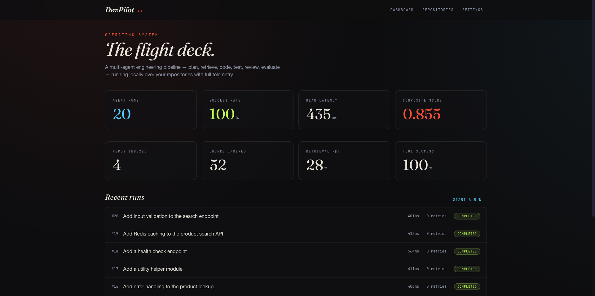
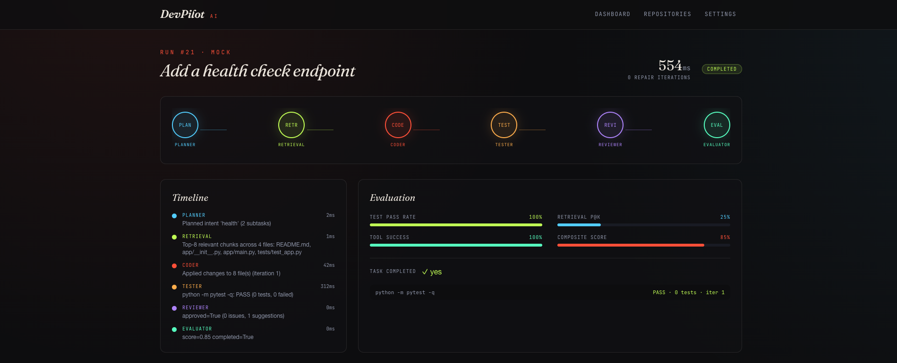
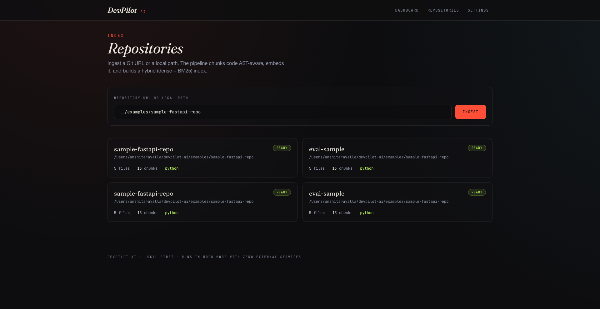
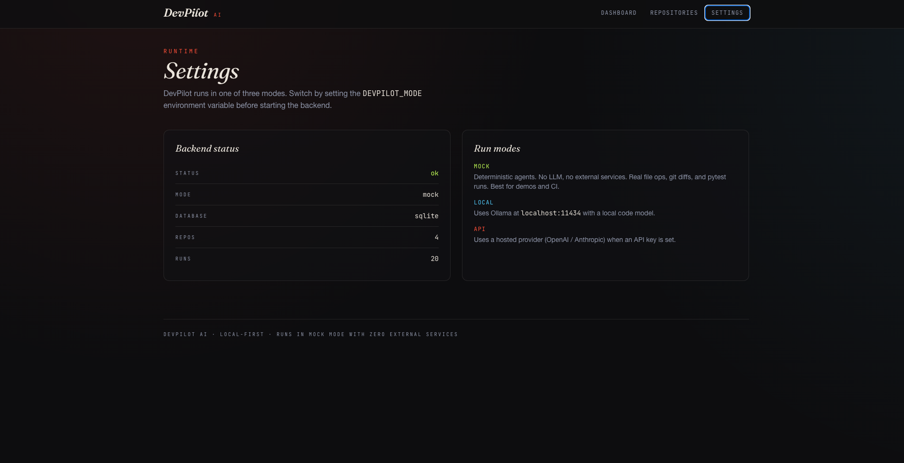
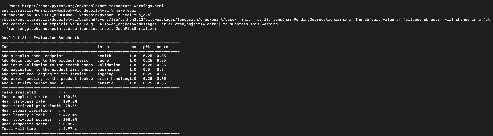
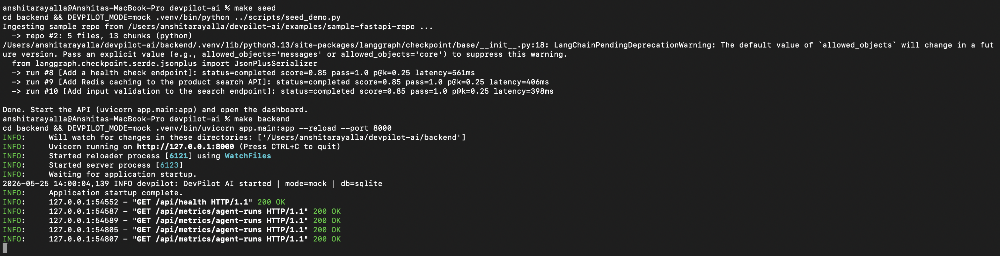

# DevPilot AI

**A local-first, multi-agent engineering operating system.** Point it at a Git
repository and give it a task — *"add a health check endpoint"*, *"add Redis
caching to the product search"* — and a six-agent pipeline plans the work,
retrieves relevant code with hybrid RAG, writes the change, runs the test suite
in a sandbox, self-heals on failure, reviews the diff, and scores the result,
with full observability throughout.

The whole system runs **end-to-end with zero external services and no API keys**
in its default `mock` mode: the agents are deterministic but do *real* work —
real file edits, real `git diff`s, real `pytest` runs. Flip a single environment
variable to run the same pipeline against a local Ollama model or a hosted
provider.

---

## Screenshots

### The flight deck — overall telemetry
20 completed agent runs, 100% success rate, ~430 ms mean latency, composite score
0.855. The lower panel lists every recent run with its latency and retry count.



### A single agent run, end to end
The six-agent workflow lit up across `Planner → Retrieval → Coder → Tester →
Reviewer → Evaluator`, with the per-step timeline on the left, evaluation bars
on the right, and the actual `pytest` invocation that the Tester ran on this
workspace.



### Indexed repositories
Each card shows the file/chunk count and detected language. Ingestion supports
Git URLs or local paths.



### Runtime settings
Backend health, current mode, and database in use, alongside the three run modes
the same pipeline supports.



### Reproducible evaluation benchmark
The numbers in this README come from `make eval`, not hand-written aspirations.



### Backend boot + seed
Mock-mode startup over SQLite after seeding three demo runs — the API is alive
and serving the dashboard's metrics endpoints.



---

## Why this exists

Most "AI coding agent" demos are a single LLM call behind a chat box. This is
the opposite: a faithful, inspectable implementation of the *systems* around an
agent — retrieval, tool use, sandboxed execution, a self-healing control loop,
evaluation, and telemetry — built so every piece runs and is testable offline.

## Architecture

```
                         ┌──────────────────────────────────────────┐
   Next.js dashboard ──► │  FastAPI  /api/repos /api/agents /metrics │
                         └───────────────┬──────────────────────────-┘
                                         │
                      ┌──────────────────▼───────────────────┐
                      │   LangGraph workflow (6 agents)      │
                      │                                      │
   Planner ─► Retrieval ─► Coder ─► Tester ─►(fail? retry)─► Reviewer ─► Evaluator
                      │       │        │         │                       │
                      │   hybrid RAG   │     sandbox runner              │
                      │ (dense+BM25)   │   (subprocess/docker)           │
                      └───────┬────────┴─────────┬───────────────────────┘
                              │                  │
                    MCP tool server      Postgres + pgvector (optional)
                 (file/git/search/lint)  SQLite + numpy index (default)
                              │
                         Prometheus ─► Grafana
```

Six agents, each a real node in a LangGraph `StateGraph` (with a manual executor
fallback if LangGraph isn't importable):

| Agent | Responsibility |
|-------|----------------|
| **Planner** | Classifies task intent, emits structured subtasks, target files, risk level |
| **Retrieval** | Hybrid RAG (dense cosine + BM25) over the indexed repo; measures precision@k on the clean workspace |
| **Coder** | Applies the change via MCP tools, returns a real `git diff` |
| **Tester** | Runs the detected test command in a sandbox, parses pass/fail |
| **Reviewer** | Heuristic + optional LLM review for risky patterns, missing tests, diff size |
| **Evaluator** | Scores the run (completion, test pass rate, precision@k, tool success) and drafts a PR summary |

The **self-healing loop** is a real conditional edge: when tests fail and repair
iterations remain, control routes back to the Coder; otherwise it proceeds to
review.

## Graceful degradation (the "local-first" part)

Every external dependency has a working in-process fallback, so the system runs
fully air-gapped and scales up when infrastructure is present:

| Capability | Default (zero-config) | Scale-up path |
|-----------|----------------------|---------------|
| Vector store | SQLite + numpy cosine index | Postgres + pgvector (ivfflat) |
| Embeddings | Deterministic feature-hash (384-dim) | sentence-transformers MiniLM |
| LLM | Deterministic mock agents | Ollama (local) or OpenAI/Anthropic (api) |
| Graph runtime | Manual executor | LangGraph `StateGraph` |
| Sandbox | `subprocess` | Throwaway Docker container |
| Test isolation | temp SQLite per test | — |

## Quick start (mock mode — no keys, no services)

```bash
# 1. Backend
make setup          # creates venv, installs deps
make seed           # ingests the sample repo + runs demo workflows
make backend        # serves the API on http://localhost:8000

# 2. Frontend (separate terminal)
make frontend-setup
make frontend       # http://localhost:3000

# 3. (optional) tests + benchmark
make test
make eval
```

No `make`? The underlying commands:

```bash
cd backend
python3 -m venv .venv && . .venv/bin/activate
pip install -r requirements.txt
DEVPILOT_MODE=mock python ../scripts/seed_demo.py
DEVPILOT_MODE=mock uvicorn app.main:app --reload --port 8000
```

## Full stack with Docker

Brings up Postgres+pgvector, Redis, the backend, the Next.js frontend,
Prometheus, and Grafana:

```bash
docker compose up --build
# frontend   http://localhost:3000
# api docs   http://localhost:8000/docs
# prometheus http://localhost:9090
# grafana    http://localhost:3001   (anonymous viewer enabled)
```

## Evaluation

The benchmark is reproducible — it runs the full pipeline over a fixed task set
against the bundled sample repo and prints aggregate metrics. The numbers below
are the **actual output** of `make eval` in mock mode (not hand-written):

```
Tasks evaluated           : 7
Task completion rate      : 100.0%
Mean test-pass rate       : 100.0%
Mean retrieval precision@k:  28.6%
Mean repair iterations    :  0
Mean latency / task       : ~420 ms
Mean tool-call success    : 100.0%
Mean composite score      :  0.857
```

Honest notes on these figures: in `mock` mode the deterministic coder produces a
self-consistent passing test on the first attempt, so **repair iterations are 0
by design** — the self-healing loop is exercised and verified separately in the
test suite (`test_self_healing_retries_then_passes`, `test_max_iterations_cap`)
using an injected flaky tester. **Precision@k (28.6%)** reflects the small
sample repo: roughly two of eight retrieved chunks come from the anchor file the
change attaches to. Run against a larger real repo for more representative
retrieval numbers. The metric is measured on the clean workspace *before* the
coder writes anything, so the agent's own new files can't inflate it.

## Tests

```bash
make test     # 17 tests
```

Covers chunking + language detection, deterministic embeddings, BM25 ranking,
hybrid retrieval over an ingested repo, MCP tools (incl. path-traversal guard
and git diffing), the full six-agent workflow, the self-healing retry loop and
its iteration cap, and the API surface end-to-end via FastAPI's `TestClient`.

## Run modes

Set `DEVPILOT_MODE`:

- **`mock`** (default) — deterministic agents, no LLM, no network. Real file
  ops, git diffs, and pytest runs. Ideal for demos and CI.
- **`local`** — uses Ollama at `localhost:11434` (`DEVPILOT_OLLAMA_MODEL`).
- **`api`** — uses OpenAI/Anthropic when `DEVPILOT_OPENAI_API_KEY` /
  `DEVPILOT_ANTHROPIC_API_KEY` is set.

In `local`/`api` modes the Coder asks the model to author the change, validates
that it compiles, and falls back to the deterministic skill if the output is
unusable — so the pipeline always yields a runnable patch.

## Project layout

```
backend/
  app/
    agents/      planner, retrieval, coder, tester, reviewer, evaluator, graph
    rag/         chunker, embeddings, bm25, retriever, ingest
    mcp/         tool server + tool implementations
    sandbox/     project detection + test runner
    llm/         provider client (mock/ollama/api) + prompts
    db/          SQLAlchemy models, session, pgvector store
    telemetry/   Prometheus metrics
    api/         repos, chat, agents, metrics routes
    main.py      FastAPI app
  eval/          reproducible evaluation harness
  tests/         pytest suite
frontend/        Next.js 14 + TypeScript + Tailwind (dark editorial UI)
examples/        sample FastAPI + Node target repos
infra/           prometheus + grafana provisioning
scripts/         seed_demo.py, git_history.sh
docs/            architecture, agent workflow, RAG design, evaluation
```

## Honest scope

This is a faithful, runnable **core** of the design — not a hardened production
system. Deliberate simplifications, all documented as extension points:

- Agent runs execute **synchronously inside the request** (no Celery/queue). The
  entry point is a clean `run_agent_workflow(db, run)` seam, so moving it behind
  a worker is mechanical.
- The mock coder uses **intent-based deterministic skills** rather than an LLM,
  so the pipeline is reproducible offline. `local`/`api` modes swap in a real
  model.
- Worker-side Prometheus metrics assume a single process; a multi-process
  deployment would add a Pushgateway.

## License

MIT — see [LICENSE](LICENSE).
